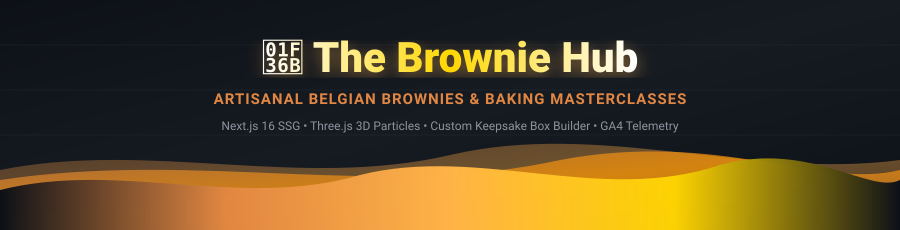
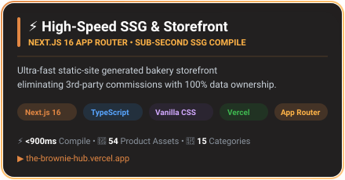
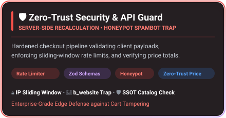
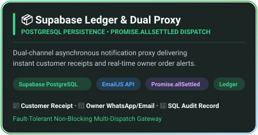

<!-- ═══════════════════════════════════════════════════════════════════════════════════ -->
<!-- ░░░  THE BROWNIE HUB — ARTISANAL BELGIAN BROWNIES & D2C GROWTH ENGINE  ░░░░░░░░░░░░ -->
<!-- ═══════════════════════════════════════════════════════════════════════════════════ -->

<!-- ╔═══════════════════════════════╗ -->
<!-- ║   ANIMATED GRADIENT HEADER    ║ -->
<!-- ╚═══════════════════════════════╝ -->
<div align="center">



<br><br>

<!-- Animated Typing SVG -->
<a href="https://git.io/typing-svg">
  
</a>

<br><br>

<!-- Badges Row 1: Deployment & Stack -->
<a href="https://the-brownie-hub.vercel.app">
  
</a>
&nbsp;
<a href="https://nextjs.org/">
  
</a>
&nbsp;
<a href="https://www.typescriptlang.org/">
  
</a>

<br><br>

<!-- Badges Row 2: Visuals, Analytics & Performance -->
<a href="https://threejs.org/">
  
</a>
&nbsp;
<a href="https://analytics.google.com/">
  
</a>
&nbsp;

&nbsp;


<br><br>

<p align="center">
  <b>A luxury D2C e-commerce platform and experiential booking engine for The Brownie Hub, Chennai. Featuring a 3D Three.js particle hero, custom magnetic gift box builder, dedicated SSG product pages, centered rolling-style checkout modal, and offline baking workshop reservations.</b>
</p>

[🍫 Live Storefront](https://the-brownie-hub.vercel.app) • [🎁 Box Builder](https://the-brownie-hub.vercel.app/custom-box) • [📜 Artisanal Menu](https://the-brownie-hub.vercel.app/menu) • [🧑‍🍳 Baking Workshops](https://the-brownie-hub.vercel.app/workshops) • [🗂️ Architecture Map](#️-real-world-project-tree-structure)

</div>

<!-- Animated Glowing Divider -->


<!-- ╔═══════════════════════════════╗ -->
<!-- ║       EXECUTIVE SUMMARY       ║ -->
<!-- ╚═══════════════════════════════╝ -->

<h2>📌 Executive Overview &amp; Problem Statement</h2>

**The Brownie Hub** is an artisanal brownie studio and baking academy based in **Chennai, Tamil Nadu, India**. 

Prior to this platform, orders were captured through manual, unstructured WhatsApp chats and static one-page hosting without cart persistence, conversion tracking, or dynamic customization. **The Brownie Hub platform** was engineered from the ground up as a **high-converting, multi-page D2C commerce architecture**:

```yaml
Storefront Status   : Production Live on Vercel Edge (HTTP 200 OK)
Target Market       : Chennai, Tamil Nadu (Anna Nagar • T. Nagar • Adyar • Velachery • OMR)
Core Capabilities   : Keepsake Box Builder • Workshop Engine • Rolling-Style Checkout Modal
Engineering Stack   : Next.js 16 (Turbopack) • TypeScript • Three.js • GSAP • Lenis • GA4
```

<!-- Animated Glowing Divider -->


<!-- ╔═══════════════════════════════╗ -->
<!-- ║      FROSTED GLASS CARDS      ║ -->
<!-- ╚═══════════════════════════════╝ -->

<h2>✨ Engineering Highlights &amp; Core Pillars</h2>

<div align="center">

<!-- Row 1: High-Speed SSG + GA4 Telemetry -->
<a href="https://the-brownie-hub.vercel.app">
  
</a>
&nbsp;&nbsp;
<a href="#-analytics--growth-intelligence-ga4">
  
</a>

<br><br>

<!-- Row 2: Zero-Trust Security + Multi-Channel Dispatch -->
<a href="#️-zero-trust-price-engine--security">
  
</a>
&nbsp;&nbsp;
<a href="#-real-time-d2c-order-pipeline">
  
</a>

</div>

<!-- Animated Glowing Divider -->


<!-- ╔═══════════════════════════════╗ -->
<!-- ║    FEATURE ARCHITECTURE       ║ -->
<!-- ╚═══════════════════════════════╝ -->

<h2>🌟 Core Platform Features</h2>

### 1. 🪐 Three.js 3D Floating Particle Hero
* **Interactive Physics**: 140+ golden cocoa and amber particles animated in a 3D canvas with cursor-follow physics, floating drift velocity, and responsive viewport resizing.
* **Fallback Resilience**: Graceful degradation to ambient radial glow if WebGL is disabled or on lower-power mobile GPUs.

### 2. 🎁 Keepsake Custom Box Builder (`/custom-box` & `/builder`)
* **Pack Sizes**: Box of 4 (₹329), Box of 6 (₹489), and Box of 12 (₹899).
* **Live Slot Visualizer**: Interactive box tray showing filled slots with flavor tags, instant slot clearing, and real-time validation before adding to cart.
* **Dietary Tagging**: Live filtering for 100% Veg / Eggless brownies vs. Classic with Egg.

### 3. 🛒 Centered "Complete Your Order" Modal (Rolling Oven Style)
* **Direct Order Trigger**: Clicking "Add to Cart" or the Navbar Cart button immediately opens the centered checkout modal dialog.
* **Customer Inputs**: Name, Email, Phone, Delivery Address, Pincode, and Special Instructions.
* **Embedded Summary**: Clean line-item breakdown (`[Item] × [Qty]` and `₹[Price]`), Free Chennai Express Delivery tag, and grand total.
* **Caramel CTA**: Pill-shaped action button `Confirm & Send Order →` paired with `Instant 1-Click WhatsApp Order`.

### 4. 🧑‍🍳 Offline Baking Workshop Reservation Engine (`/workshops`)
* **Masterclass Portfolio**:
  - *Fudge Brownie Masterclass* (₹1,499 • 3 Hours • Hands-on)
  - *Eggless Baking Intensive* (₹1,799 • 4 Hours • Masterclass)
  - *Junior Baker Academy* (₹999 • 2 Hours • Fun Workshop)
* **Interactive Reservation Modal**: Date picker, seat counter, attendee details, and instant confirmation dispatch.

### 5. ⚡ Pre-Rendered SSG Product Pages (`/product/[id]`)
* **Dedicated URLs**: High-converting, SEO-optimized landing pages for all brownie varieties (`/product/classic-fudge-veg`, `/product/walnut-crackle-veg`, `/product/salted-caramel-swirl-veg`, etc.).
* **Rich Microdata**: Schema.org `Product` JSON-LD markup with pricing, availability, and allergen disclosures.

<!-- Animated Glowing Divider -->


<!-- ╔═══════════════════════════════╗ -->
<!-- ║    PROJECT ARCHITECTURE MAP   ║ -->
<!-- ╚═══════════════════════════════╝ -->

<h2>🗂️ Real-World Project Tree Structure</h2>

```
the-brownie-hub-testing/
├── 📂 assets/                              # Vector SVGs, SMIL animations & live architecture flows
│   ├── 🎨 architecture-diagram.svg         # Real-time SMIL animated system architecture
│   ├── 🛒 cart-flow-banner.svg             # 5-stage D2C commerce pipeline visual
│   ├── ⚡ card-engine.svg                  # Sub-1.5s SSG storefront glass card
│   ├── 📊 card-telemetry.svg               # GA4 e-commerce CRO glass card
│   ├── 🛡️ card-security.svg                # Zero-trust edge firewall glass card
│   ├── 📦 card-dispatch.svg                # Dual proxy order dispatch glass card
│   ├── 🌊 header-banner.svg                # SMIL-animated gradient header banner
│   └── 🌊 footer-banner.svg                # SMIL-animated gradient footer banner
│
├── 📂 public/                              # Static client assets & photography
│   ├── 📂 images/brownies/                 # High-resolution Belgian brownie catalog photography
│   ├── 📜 main.js                          # Client-side state machine (Cart, Modal, Audio, GA4)
│   ├── 🖼️ apple-touch-icon.png             # iOS home screen touch icon
│   └── 🖼️ favicon.ico / .png               # Multi-format branding favicons
│
├── 📂 src/
│   ├── 📂 app/                             # Next.js 16 App Router (29 SSG Routes)
│   │   ├── 📂 about/                       # Brand heritage & founders story page
│   │   ├── 📂 api/
│   │   │   ├── 📂 contact/                 # Inquiry API with rate limiting & honeypot
│   │   │   ├── 📂 feedback/                # Review submission API
│   │   │   ├── 📂 order/                   # Server-side price integrity & order dispatch
│   │   │   └── 📂 workshop/                # Workshop reservation booking API
│   │   ├── 📂 builder/                     # Dedicated full-page custom box builder
│   │   ├── 📂 contact/                     # Direct kitchen contact & inquiry page
│   │   ├── 📂 custom-box/                  # Primary keepsake box customization page
│   │   ├── 📂 menu/                        # Full artisanal catalog with dietary filters
│   │   ├── 📂 product/[id]/                # Static SSG dynamic product pages (generateStaticParams)
│   │   ├── 📂 reviews/                     # Customer testimonials & verified review hub
│   │   ├── 📂 workshops/                   # Offline baking masterclass schedule & booking
│   │   ├── 🎨 globals.css                  # Zero-framework CSS design system (tokens, dark luxury)
│   │   ├── 📄 layout.tsx                   # Master root layout (Fonts, Scripts, Global Modals)
│   │   ├── 📄 page.tsx                     # Modular composed homepage
│   │   ├── 🤖 robots.ts                    # Dynamic robots.txt generation
│   │   └── 🗺️ sitemap.ts                   # Dynamic XML sitemap indexing all 29 routes
│   │
│   ├── 📂 components/                      # Modular UI Component Architecture
│   │   ├── 📂 home/                        # Homepage Feature Sections
│   │   │   ├── BentoShowcaseSection.tsx    # Luxury bento grid with sensory proof & stats
│   │   │   ├── BoxBuilderSection.tsx       # Embedded interactive keepsake box builder
│   │   │   ├── ContactSection.tsx          # Kitchen contact details & direct inquiry form
│   │   │   ├── FaqSection.tsx              # Accordion FAQ (delivery, storage, dietary)
│   │   │   ├── FoundersSection.tsx         # Artisanal credentials & kitchen philosophy
│   │   │   ├── HeroParticles.tsx           # Three.js 3D gold dust canvas controller
│   │   │   ├── HeroSection.tsx             # Hero banner with dynamic CTAs & live trust badges
│   │   │   ├── MenuSection.tsx             # Artisanal brownie favorites showcase
│   │   │   ├── TrustBarSection.tsx         # 4-pillar trust strip (Belgian, Fresh, Delivery, Handcrafted)
│   │   │   └── WorkshopSection.tsx         # Offline masterclass preview cards
│   │   ├── CartDrawer.tsx                  # Cart drawer component (alternative quick-view)
│   │   ├── FloatingWhatsApp.tsx            # Ambient floating 1-click WhatsApp order capsule
│   │   ├── Footer.tsx                      # Luxury footer with verified Instagram/WhatsApp SVG pills
│   │   ├── Navbar.tsx                      # Persistent glassmorphic navbar with active link indicator
│   │   ├── OrderModal.tsx                  # Rolling Oven style centered Complete Your Order modal
│   │   ├── ToastContainer.tsx              # Dynamic toast notification toaster
│   │   └── WorkshopModal.tsx               # Masterclass seat reservation modal dialog
│   │
│   └── 📂 lib/                             # Core Data Models, Analytics & Validations
│       ├── analytics.ts                    # GA4 e-commerce helper utilities
│       ├── products.ts                     # Single Source of Truth brownie catalog (13 items)
│       ├── validations.ts                  # Zod schemas (order, contact, workshop, feedback)
│       └── workshops.ts                    # Masterclass curriculum, pricing & schedule data
│
├── ⚙️ next.config.ts                       # Next.js compiler optimizations
├── 📦 package.json                         # Dependencies & npm scripts
├── 📘 PROJECT_MEMORY_DOSSIER.md            # Executive MBA analytics memory archive
└── 📖 README.md                            # Comprehensive project documentation
```

<!-- Animated Glowing Divider -->


<!-- ╔═══════════════════════════════╗ -->
<!-- ║        GETTING STARTED        ║ -->
<!-- ╚═══════════════════════════════╝ -->

<h2>🚀 Local Development &amp; Deployment</h2>

### 1. Clone & Install
```bash
git clone https://github.com/sugan0025/-The-Brownie-Hub-testing.git
cd the-brownie-hub-testing
npm install
```

### 2. Run Local Development Server
```bash
npm run dev
# Live on http://localhost:3000
```

### 3. Production Build
```bash
npm run build
# Compiles all 29 SSG routes in ~1.4s with 0 errors
```

---

<div align="center">


<br>

<b>The Brownie Hub</b> • Handcrafted with love in Chennai, Tamil Nadu • 100% Direct D2C Experience

</div>
